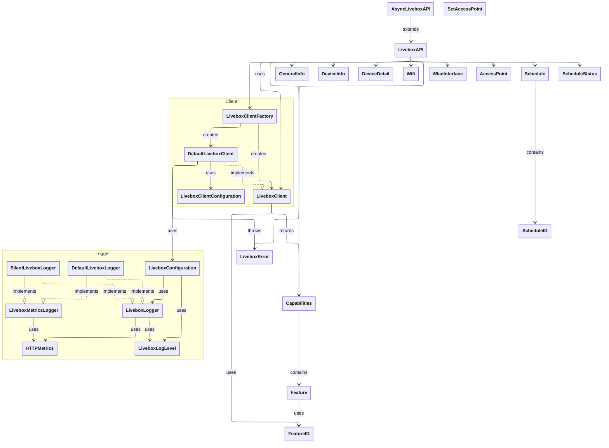

# Livebox SDK Architecture

This document provides an overview of the Livebox SDK architecture using class diagrams.

## Framework Architecture

The following diagram shows the main components and their relationships in the Livebox SDK:

## Architecture Overview

The Livebox SDK is organized into several distinct layers:

### 1. Configuration Layer
- **LiveboxConfiguration**: Singleton that manages global framework settings
- **Logging System**: Protocol-based logging with multiple implementations

### 2. Client Layer
- **LiveboxClient**: Protocol defining the low-level HTTP client interface
- **DefaultLiveboxClient**: Default implementation handling HTTP requests and router communication
- **LiveboxClientConfiguration**: Configuration object for client settings

### 3. Service Layer
- **LiveboxAPI**: High-level service providing convenient methods for router operations
- **AsyncLiveboxAPI**: Type alias providing async/await extensions

### 4. Model Layer
- **Core Models**: `GeneralInfo`, `Capabilities` for router information
- **Device Models**: `DeviceInfo`, `DeviceDetail` for connected device management
- **WiFi Models**: `Wifi`, `WlanInterface`, `AccessPoint` for wireless network management
- **Schedule Models**: `Schedule`, `ScheduleID` for time-based access control

### 5. Error Handling
- **LiveboxError**: Centralized error enumeration for all framework operations

## Key Design Patterns

### Protocol-Oriented Design
- `LiveboxLogger` and `LiveboxClient` use protocols for flexibility and testability
- Multiple implementations available (e.g., `DefaultLiveboxLogger`, `SilentLiveboxLogger`)

### Factory Pattern
- `LiveboxClientFactory` centralizes client creation logic
- Supports both real and mock implementations

### Type Safety
- `ScheduleID` provides compile-time safety for schedule operations
- `FeatureID` enum prevents typos in feature identifiers

### Singleton Configuration
- `LiveboxConfiguration` provides global settings management
- Allows runtime configuration of logging and other framework behaviors

### Async/Await Support
- `AsyncLiveboxAPI` extends the main service with modern Swift concurrency
- Maintains backward compatibility with callback-based APIs

## Module Structure

The framework is split into two modules:

1. **Livebox**: Core functionality with callback-based APIs
2. **LiveboxAsync**: Async/await extensions for modern Swift concurrency

This design allows developers to choose their preferred concurrency model while maintaining a clean separation of concerns.
